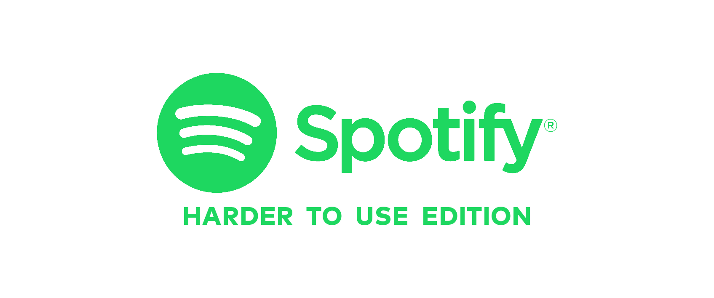

# SPOTIFY: HARDER TO USE EDITION
My original idea was to actually have Spotify API but it's super buggy and it's api key expires every hour. So, I have the skin of a spotify "client" but the backend from youtube.

## Getting Started
[Link to my app!](https://protected-lake-45151.herokuapp.com/)

### Prerequisites
Keyboard, mouse, and a sense of humor.

## Built With
* [Node.js](https://nodejs.org/en/) - Node.js® is a JavaScript runtime built on Chrome's V8 JavaScript engine
* [Mongoose](https://mongoosejs.com/) - elegant mongodb object modeling for node.js
* [Express](https://expressjs.com/) - Fast, unopinionated, minimalist web framework for Node.js
* [ReactJS](https://reactjs.org/) - A JavaScript library for building user interfaces

## Authors
* **Taylor Yip** - *Initial work* - [yippptay](https://github.com/yippptay)
* **Roelof van Krimpen** - *Second Opinion* - [roelofvkr](https://github.com/roelofvkr)
* **Arthur Bernier Jr** - *Renaissance Man* - [arthurbernierjr](https://git.generalassemb.ly/arthurbernierjr)

## Acknowledgments
My 7 cans of NOS energy drinks.

